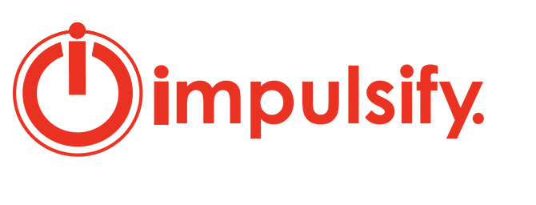
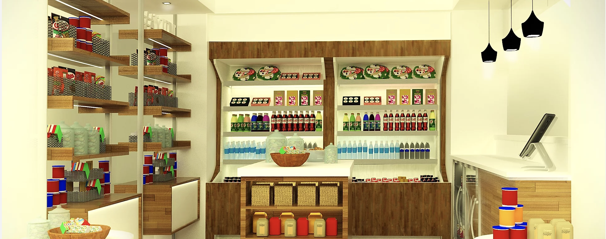

# Impulse Spending

### BACKGROUND
ImpulsePoint by Impulsify is a top-rated front desk point-of-sale and retail management system for hotel lobbies. It automates nearly the entire retail system, from inventory maintenance to guest checkout. This system is built on data and it allows hotels to focus on exactly what guests want and respond accordingly. 

### OBJECTIVE
Impulsify's data science request was to create an interactive program for prospective clients. A hotel would input its brand, number of rooms, and several other location specific financial measurements. These metrics would be used to predict their sales per occupied room (SPOR), future revenue and profit, the increase in revenue and profit and the estimated ROI. 

